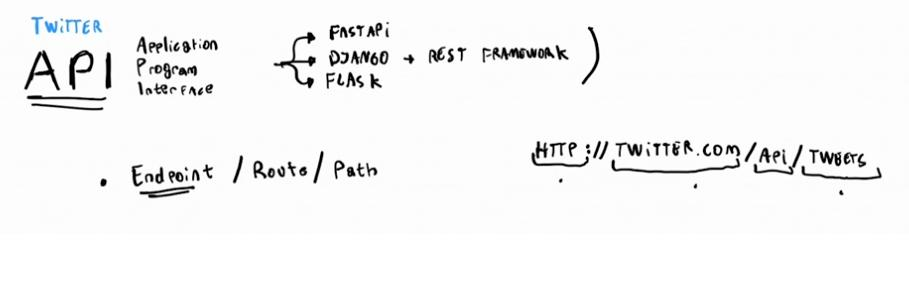
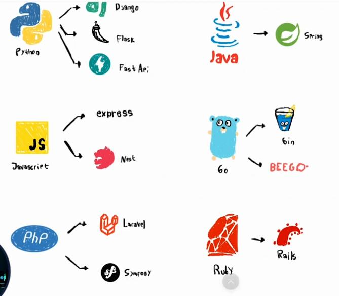

# [Introducción al Desarrollo Backend](https://platzi.com/clases/introduccion-backend/)

## 1 - [Yin y Yang de una aplicación: frontend y backend](https://platzi.com/clases/2508-introduccion-backend/41811-yin-y-yang-de-una-aplicacion-frontend-y-backend/)

## 2 - [Framework vs. librería](https://platzi.com/clases/2508-introduccion-backend/41812-framework-vs-libreria/)

**Libreria:** Codigo escrito por otros usuarios para facilitar el diseño  
**Framework:** Marco de trabajo, conjunto de librerias, reglas y estandares para contruir un producto

- Librerías en Python:  
requests.  
tqdm.  
pillow.  
scrapy.  
numpy.  
pandas.  
scapy.  
matplotlib.  
  
- Frameworks en Python:  
Fast API  
Flask  
Django  

## 4 [Cómo se conecta el frontend con el backend: API y JSON](https://platzi.com/clases/2508-introduccion-backend/41813-como-se-conecta-el-frontend-con-el-backend-api-y-j/)

- Términos hablados en la clase:
API —> Application Programming Interface  
SOAP —> Simple Object Access Protocol  
REST —> Representational State Transfer  
XML —> Extensible Markup Language  
JSON —> JavaScript Object Notation  

## 5 [El lenguaje que habla Internet: HTTP](https://platzi.com/clases/2508-introduccion-backend/41814-el-lenguaje-que-habla-internet-http/)

## 6 [¿Cómo es el flujo de desarrollo de una aplicación web?](https://platzi.com/clases/2508-introduccion-backend/41815-como-es-el-flujo-de-desarrollo-de-una-aplicacion-w/)

## 7 [El hogar de tu código: el servidor](https://platzi.com/clases/2508-introduccion-backend/41816-el-hogar-de-tu-codigo-el-servidor/)

IaaS: Infrastructure as a service

    AWS
    Microsoft Azure
    Digital Ocean

PaaS

    Firebase
    Heroku
    Google App Engine

SaaS: Software as a service

    Slack
    Workdpress
    Google Docs

## 8 [Proyecto: diseño y bosquejo de una API](https://platzi.com/clases/2508-introduccion-backend/41817-proyecto-diseno-y-bosquejo-de-una-api/)

## 9 [Proyecto: diseñando los endpoints de los Tweets](https://platzi.com/clases/2508-introduccion-backend/41818-proyecto-disenando-los-endpoints-de-los-tweets/)

## 11 [Qué lenguaje y framework escoger para backend](https://platzi.com/clases/2508-introduccion-backend/41820-que-lenguaje-y-framework-escoger-para-backend/)

- Django es un fuerte framework en Python, el cual está dirigido al desarrollo web escalable y de buena calidad.

- Flask es un micro-framework orientado a API’s o a una gran carga de visitas a una página web. Es apto para proyectos altamente personalizados y sencillos.

